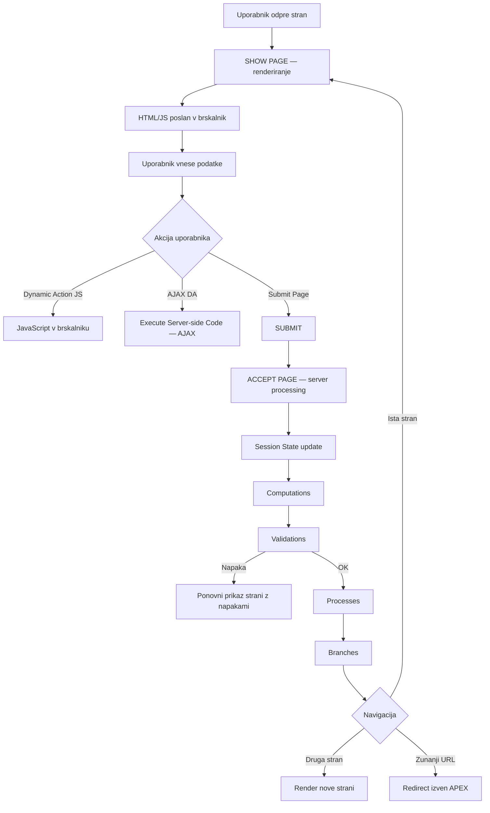

# Oracle APEX – arhitektura izvajanja (razširjena verzija)

Ta dokument podrobneje opisuje, kako Oracle APEX izvaja kodo na strani odjemalca in strežnika,
ter vključuje diagram toka izvajanja (Execution Flow).

---

## Osnovni model delovanja

Oracle APEX deluje kot **request/response engine nad Oracle Database**.

Dve ključni fazi:

- **Show Page (Render Phase)** — priprava strani za prikaz
- **Accept Page (Process Phase)** — obdelava oddanih podatkov

Ključni koncept: **Session State** (strežniška hramba vrednosti itemov)

---

## Execution Flow — Diagram

Spodnji diagram (Mermaid) prikazuje tipičen tok izvajanja ob Submit Page.



---

## Execution Flow — Podrobna razlaga

### 1. Show Page (Render Phase)

APEX:

- prebere definicijo strani iz metapodatkov
- izvede pre-render computations/processes
- zgradi regione, iteme, gumbe
- generira HTML, CSS, JavaScript
- pošlje vse v brskalnik

---

### 2. Client-side delovanje

V brskalniku poteka:

- vnos podatkov
- JavaScript
- Dynamic Actions
- validacije na strani odjemalca (če obstajajo)

---

### 3. Dynamic Actions

Dynamic Actions lahko:

#### a) JavaScript-only

- brez komunikacije s strežnikom
- brez session state posodobitve
- brez page processing pipeline

#### b) Execute Server-side Code (AJAX)

- delna komunikacija s strežnikom
- pošljejo se samo navedeni Page Items to Submit
- ne izvede se polni Accept Page lifecycle

#### c) Submit Page

- sproži polno obdelavo na strežniku

---

### 4. Accept Page (Process Phase)

Ob Submit Page APEX:

1. prejme POST zahtevek
2. shrani vrednosti itemov v session state
3. določi REQUEST (običajno ime gumba)
4. izvede submit-time computations
5. izvede validations
6. če validacije uspejo → processes
7. določi branch
8. navigira ali ponovno prikaže stran

---

## Key Components — Podrobno

### Session State

Server-side shramba vrednosti itemov.

Omogoča uporabo v PL/SQL:

```
:P10_EMP_ID
:P10_NAME
```

---

### REQUEST

Identifikator akcije.

Najpogosteje:

- ime gumba
- parameter iz apex.submit()
- posebna vrednost za navigacijo

Uporablja se v pogojih procesov, validationov in branch-ev.

---

### Computations

Nastavijo vrednost itema ob določenem trenutku.

Uporaba:

- default vrednosti
- izračuni
- priprava podatkov za procese

Primer:

```plsql
:P10_TOTAL := :P10_QTY * :P10_PRICE;
```

---

### Validations

Preverjajo pravilnost podatkov.

Če validation ne uspe:

- procesi se ne izvedejo
- stran se ponovno prikaže
- uporabnik vidi napake

---

### Processes

Glavna poslovna logika.

Primeri:

- DML operacije
- klic PL/SQL paketov
- avtomatska obdelava forme
- Interactive Grid processing
- klic API-jev

---

### Branches

Določajo naslednji korak navigacije.

Možnosti:

- ista stran
- druga APEX stran
- zunanji URL
- pogojno glede na REQUEST ali druge pogoje

---

## Submit Page — Kaj NI

Submit Page sam po sebi:

- ne shrani podatkov v tabelo
- ne naredi COMMIT-a
- ne določi navigacije
- ne vsebuje poslovne logike

Je samo sprožilec za Accept Page lifecycle.

---

## Page Items to Submit — Ključni koncept pri AJAX

Pri AJAX klicih:

- APEX ne pošlje samodejno vseh itemov
- pošljejo se samo navedeni itemi

Če item ni v seznamu:

- server vidi staro vrednost
- ali NULL

---

## Celotna mentalna slika

APEX stran lahko razumemo kot pipeline:

```
Render → User Interaction → Submit/AJAX → Session State → Validation → Processing → Branch → Render
```

---

## Ultra-kratka poenostavitev

- Computation = nastavi vrednost
- Validation = preveri pravilnost
- Process = izvede logiko
- Branch = določi navigacijo

---

## Zaključek

Ključ do razumevanja APEX arhitekture je razlika med:

- client-side logiko (Dynamic Actions, JavaScript)
- server-side logiko (Submit Page lifecycle)

Ko razumeš tok:

**submit → session state → validations → processes → branches → render**

postane analiza in migracija APEX aplikacij bistveno lažja.
